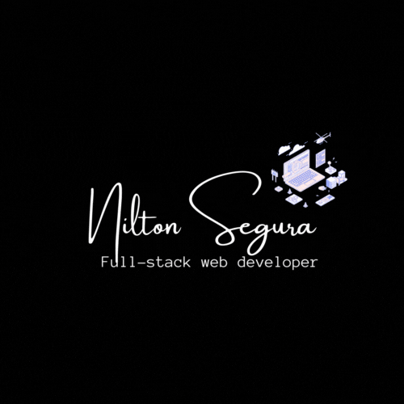

<a name="readme-top"></a>

<div align="center">
  <!-- You are encouraged to replace this logo with your own! Otherwise you can also remove it. -->
  
  <br/>
</div>

# 📗 Table of Contents

- [📗 Table of Contents](#-table-of-contents)
- [📖 Blog Web ](#-blog-web-)
  - [🛠 Built With ](#-built-with-)
    - [Tech Stack ](#tech-stack-)
    - [Key Features ](#key-features-)
  - [💻 Getting Started ](#-getting-started-)
    - [Prerequisites](#prerequisites)
    - [Setup](#setup)
    - [Install](#install)
    - [Usage](#usage)
    - [Run tests](#run-tests)
    - [Deployment](#deployment)
  - [👥 Authors ](#-authors-)
  - [🔭 Future Features ](#-future-features-)
  - [🤝 Contributing ](#-contributing-)
  - [⭐️ Show your support ](#️-show-your-support-)
  - [🙏 Acknowledgments ](#-acknowledgments-)
  - [📝 License ](#-license-)

<!-- PROJECT DESCRIPTION -->

#  Blog Web<a name="about-project"></a>

> Functional website that will show the list of posts and empower readers to interact with them by adding comments and liking posts.

## 🛠 Built With <a name="built-with"></a>

### Tech Stack <a name="tech-stack"></a>

> This project uses the following stack :

<details>
<summary>Ruby</summary>
  <ul>
    <li><a href="https://www.ruby-lang.org/en/">Ruby</a></li>
  </ul>
</details>
  <details>
  <summary>Rails</summary>
  <ul>
    <li><a href="https://rubyonrails.org/">Rails</a></li>
  </ul>
</details>

<!-- Features -->

### Key Features <a name="key-features"></a>

> Here are some key features of the application :

- **Creating a data model using migration files to build the WebApp schema.**
- **Creating model classes for all entities**
- **Processing data in models.**
- **Use of validations and unit test for models**
- **Setup and controllers.**

<p align="right">(<a href="#readme-top">back to top</a>)</p>

<!-- GETTING STARTED -->

## 💻 Getting Started <a name="getting-started"></a>

> Clone the repository by clicking on the 'Code' button and copy the link

To get a local copy up and running, follow these steps.

### Prerequisites

In order to run this project you need:

- Ruby 3.2.2

### Setup

Clone this repository to your desired folder:

```sh
  cd my-folder
  git clone https://github.com/Nkaleth/blog_web.git
  cd blog_web
```

### Install

```sh
  bundle install
```

### Usage

To run the project, execute the following command:

```sh
  rails s
```

<p align="right">(<a href="#readme-top">back to top</a>)</p>

<!-- AUTHORS -->

## 👥 Author <a name="author"></a>

👤 **Nilton Segura**

- GitHub: [@Nkaleth](https://github.com/Nkaleth)
- Twitter: [@NoeSeguraL](https://twitter.com/NoeSeguraL)
- LinkedIn: [LinkedIn](https://www.linkedin.com/in/niltonsegura/)

<p align="right">(<a href="#readme-top">back to top</a>)</p>

<!-- FUTURE FEATURES -->

## 🔭 Future Features <a name="future-features"></a>

- **Controllers specs.**
- **Views.**
- **Forms.**

<p align="right">(<a href="#readme-top">back to top</a>)</p>

<!-- CONTRIBUTING -->

## 🤝 Contributing <a name="contributing"></a>

Contributions, issues, and feature requests are welcome!

Feel free to check the [issues page](../../issues/).

<p align="right">(<a href="#readme-top">back to top</a>)</p>

<!-- SUPPORT -->

## ⭐️ Show your support <a name="support"></a>

If you like this project follow me and star it!

<p align="right">(<a href="#readme-top">back to top</a>)</p>

<!-- ACKNOWLEDGEMENTS -->

## 🙏 Acknowledgments <a name="acknowledgements"></a>

I would like to thank to [Microverse](https://www.microverse.org/).<br>

<p align="right">(<a href="#readme-top">back to top</a>)</p>
<!-- LICENSE -->

## 📝 License <a name="license"></a>

This project is [licensed](./MIT.md) .

<p align="right">(<a href="#readme-top">back to top</a>)</p>
